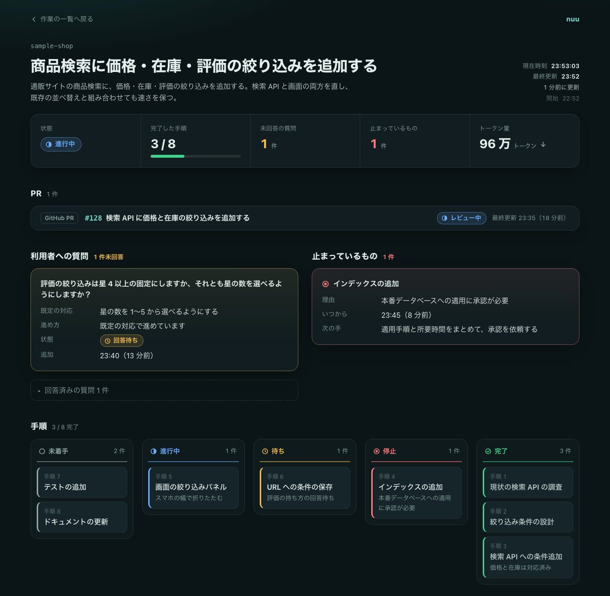
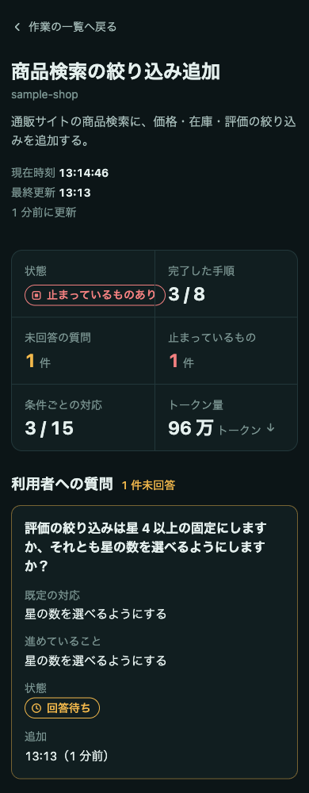
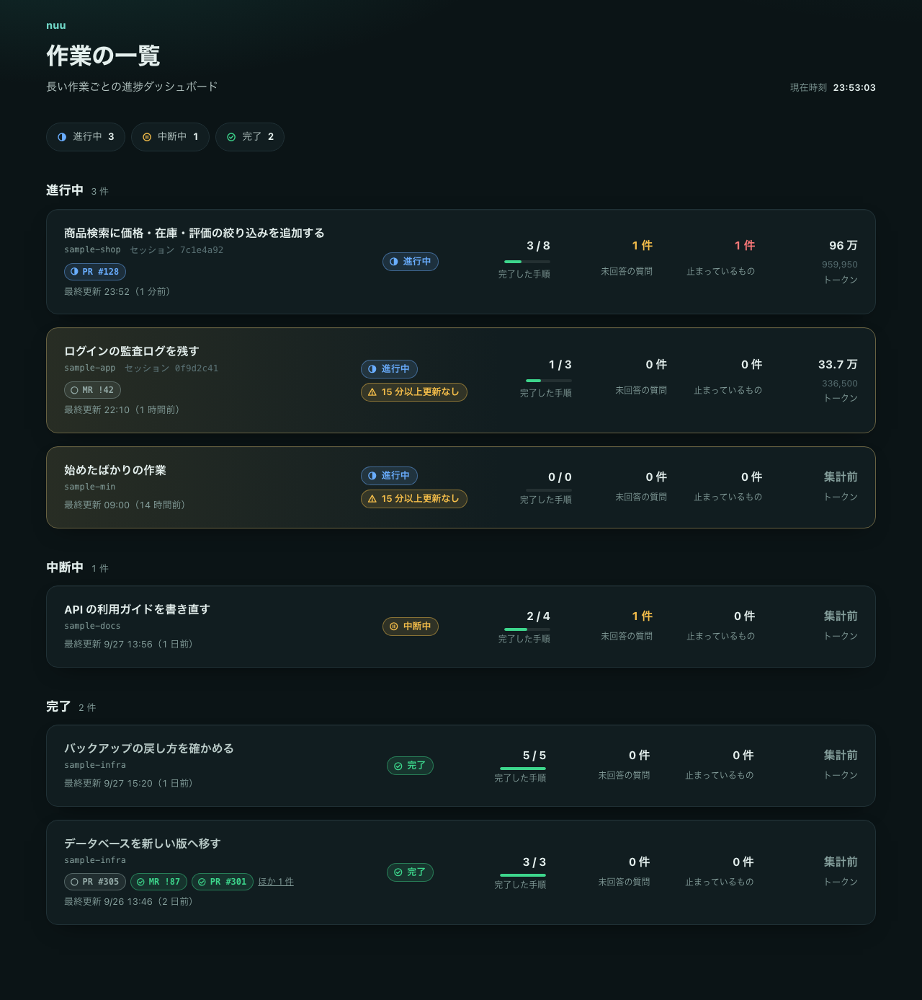

<h1>
  <picture>
    <source media="(prefers-color-scheme: dark)" srcset="docs/images/logo-dark.svg">
    
  </picture>
</h1>

Claude Code で長い作業をするときに、進み具合を 1 枚の HTML で見られるようにするサブエージェントです。ダッシュボードを用意する `dashboard-builder` と、途中の更新と完了を行う `dashboard-updater` の 2 つで動きます。ページの見た目と動きはリポジトリの固定のクライアント（`client/`）が受け持ち、サブエージェントは作業のデータだけを書きます。

> [!NOTE]
> 実験的なツールです。動作は macOS と Claude Code 2.1.283 で確認しています。Claude Code の更新によって、動きが変わったり、一部の表示が出なくなったりすることがあります。

<table>
  <tr>
    <th width="75%">作業ごとのダッシュボード</th>
    <th width="25%">スマホで見たとき</th>
  </tr>
  <tr>
    <td valign="top"></td>
    <td valign="top"></td>
  </tr>
  <tr>
    <th colspan="2">全体の一覧</th>
  </tr>
  <tr>
    <td colspan="2"></td>
  </tr>
</table>

画像は、架空の通販サイトの作業で作った見本です。見た目は固定で、テーマ、密度、アクセントカラー、タスクの表示を好みで変えられます。作業に合わせて変わるのは、載せるパネルの種類、並び、中身です。

## できること

- 長い作業の前に、作業ごとのダッシュボードを 1 枚作る。手順と状態、利用者への質問と既定の対応、成果物、止まっているものが並ぶ
- 作業中に判断が必要になっても止まらず、質問と既定の対応を載せて作業を続ける
- 全プロジェクトの作業を 1 つの一覧にまとめる。更新が止まっている作業は目立たせる
- ブラウザで開くだけで見られる。10 秒ごとにデータだけを読み直す
- 関係する GitHub / GitLab の PR・MR、Issue、リリースと、使ったトークン量の目安を載せる
- Claude Code の中でも、`/nuu` で進み具合を見られる（実験的。[Claude Code mods](#claude-code-mods実験的)）

ダッシュボードとエージェントへの指示は日本語です。

## 必要なもの

- macOS または Linux
- Claude Code（CLI か、デスクトップアプリで開く Code（ローカル））。クラウドと Cowork では使えません
- bash、jq、python3、git

## セットアップ

```sh
git clone https://github.com/shimabox/nuu.git
cd nuu
./install.sh
```

`~/.claude` にサブエージェント、フック、ルールなどへのリンクを作り、`~/.claude/CLAUDE.md` にルールを読み込む 1 行を、`~/.claude/settings.json` に mod のパスを足します。以後は `git pull` するだけで新しくなります。外すときは `./uninstall.sh` を使います。

## 使い方

5 ステップを超える作業や、30 分を超えそうな作業を Claude Code に頼むと、作業の前にダッシュボードが作られます。確実に使いたいときは「ダッシュボードを用意してから進めて」と頼みます。初回だけ、テーマ、密度、アクセントカラーを聞かれます。

全プロジェクトの一覧は、次のコマンドで開きます。

```sh
open ~/.claude/nuu/dashboards/index.html
```

## Claude Code mods（実験的）

ブラウザを開かなくても、Claude Code の中で進み具合を見られます。Claude Code の mod（function hooks のプラグイン）の機能を使っていて、この機能は Claude Code の early access のため、Claude Code の更新で動かなくなることがあります。Claude Code 2.1.289 の CLI で確認しています。

- `/nuu`: 今のプロジェクトの作業をペインに出します。作業ディレクトリが同じか、プロジェクト名がリポジトリの名前と同じ作業を、進行中を先にして並べます。worktree でも元のリポジトリの名前で見つけます
- `/nuu all`: 全プロジェクトの作業を出します
- 帯: 進行中の作業があるあいだ、プロンプトの上に作業名、進み具合、未回答の質問の数を 1 行で出します。「詳細」でペインを開き、「隠す」で消します
- 新しい質問が載ると、トーストで知らせます

ペインには、状態、要約、進み具合、未回答の質問と既定の対応、止まっているもの、手順、GitHub / GitLab の項目を出します。ペインを開いた直後は、次のキーで操作できます。

| キー | 操作 |
|---|---|
| `o` | ブラウザでダッシュボードを開く |
| `n` / `p` | 次の作業 / 前の作業 |
| `a` | 今のプロジェクトと全プロジェクトを切り替える |
| `Tab` | ボタンを移る |
| `q` / `Esc` | 閉じる |

プロンプトに戻ったあとは、`ctrl+x` のあと `tab` でペインに戻ります。`/tui fullscreen` で全画面の表示にすると、ペインは会話の横に並び、クリックでも操作できます。

ペインは `.data.js` を 10 秒ごとに読み直すだけで、ダッシュボードには何も書きません。

## ドキュメント

- [説明ページ](https://shimabox.github.io/nuu/): 全体の流れと仕組みを図で見る
- [セットアップ](docs/setup.md): 使える環境、`install.sh` が作るもの、注意、アンインストール
- [使い方](docs/usage.md): できることの一覧、途中で止める、完了にする、作業を消す、セッションに戻る、GitHub / GitLab の項目、トークン量、好みとモデルの変え方
- [仕組み](docs/architecture.md): エージェントの分担、構成、料金の目安、テスト、参考にした考え方
- [TODO](docs/TODO.md)

## 名前の由来

「ぬー」は沖縄の言葉で「何」という意味です。「ぬーやが？（なに？）」のように使います。

長い作業の途中で「今なにしてる？」と気になったとき、このダッシュボードを開けば答えがわかる。その問いかけの一言を名前にしました。

## ライセンス

MIT License です。詳しくは [LICENSE](LICENSE) を見てください。
