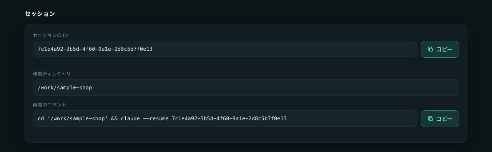
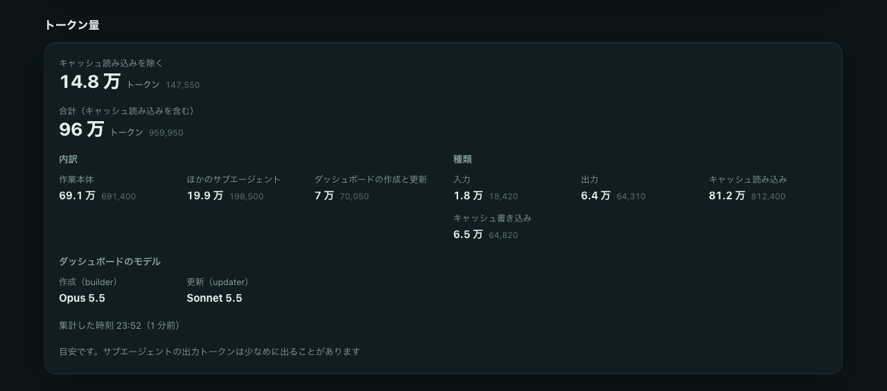

<h1>
  <picture>
    <source media="(prefers-color-scheme: dark)" srcset="docs/images/logo-dark.svg">
    
  </picture>
</h1>

Claude Code で長い作業をするときに、進み具合を 1 枚の HTML で見られるようにするサブエージェントです。ダッシュボードを用意する `dashboard-builder` と、途中の更新と完了を行う `dashboard-updater` の 2 つで動きます。ページの見た目と動きはリポジトリの固定のクライアント（`client/`）が受け持ち、サブエージェントは作業のデータだけを書きます。

> [!NOTE]
> 実験的なツールです。動作は macOS と Claude Code 2.1.283 で確認しています。Claude Code の更新によって、動きが変わったり、一部の表示が出なくなったりすることがあります。

<table>
  <tr>
    <th width="75%">作業ごとのダッシュボード</th>
    <th width="25%">スマホで見たとき</th>
  </tr>
  <tr>
    <td valign="top"></td>
    <td valign="top"></td>
  </tr>
  <tr>
    <th colspan="2">全体の一覧</th>
  </tr>
  <tr>
    <td colspan="2"></td>
  </tr>
  <tr>
    <th colspan="2">作業ごとのダッシュボードの下部にある、セッションの欄</th>
  </tr>
  <tr>
    <td colspan="2"></td>
  </tr>
  <tr>
    <th colspan="2">作業ごとのダッシュボードの下部にある、トークン量の欄</th>
  </tr>
  <tr>
    <td colspan="2"></td>
  </tr>
</table>

画像は、架空の通販サイトの作業で作った見本です。見た目は固定で、テーマ、密度、アクセントカラー、タスクの表示を好みで変えられます。作業に合わせて変わるのは、載せるパネルの種類、並び、中身です。

## 仕組み

https://shimabox.github.io/nuu/

## 名前の由来

「ぬー」は沖縄の言葉で「何」という意味です。「ぬーやが？（なに？）」のように使います。

長い作業の途中で「今なにしてる？」と気になったとき、このダッシュボードを開けば答えがわかる。その問いかけの一言を名前にしました。

## できること

- 作業ごとに 1 枚のダッシュボードを作り、タスクと状態、利用者への質問と既定の対応、最新の成果物、止まっているものを表示する
- 作業に合わせて、7 種類のパネル（進み具合の棒、マス目、表、項目と値、文章、推移のグラフ、段階の流れ）から選んで載せる
- 全プロジェクトの作業を並べた一覧を作る。進行中、中断中、完了の順に並び、進行中なのに更新が止まっている作業は目立たせる
- ダッシュボードは `~/.claude/nuu/dashboards/` にまとめ、作業ディレクトリには何も作らない
- ブラウザで開くだけで見られる。サーバーもツールも要らず、10 秒ごとにデータだけを読み直す。ページを再読み込みしないので、ちらつかず、スクロール位置も開いた詳細もそのまま残る
- ページの見た目と動きはリポジトリの `client/` が受け持つ。`git pull` すれば、前に作ったダッシュボードも、開き直したときに新しい動きになる
- 時刻はすべて実際の時計から取る
- 初回に好みのスタイル（テーマ、密度、アクセントカラー）を聞き、すべてのダッシュボードに使う。好みを変えると、開いているページにも 10 秒ほどで届く
- タスクはカンバン（状態ごとの列）で表示する。頼めばリストにも変えられる
- 完了した作業には、未着手や途中の値を残さない。やらないと決めた手順やパネルの項目は「見送り」として残す
- スマホの幅でも読めるように表示する。狭い画面では、カンバンの列を縦に積み、表を 1 行ずつのカードにする
- 作業に関係する GitHub / GitLab の項目（Pull Request（PR）・Merge Request（MR）、Issue、リリース、作業で作ったリポジトリ）を、種類、番号か題名、状態、最終更新と一緒に表示する。一覧の各行にも「PR #7」「Issue #12」「リリース v1.2.0」のような札を出し、押すとその項目を開ける
- 作業で使ったトークン量の目安と、ダッシュボードを作成・更新したモデルを表示する
- 作業したセッションの ID と、`claude --resume` で再開するコマンドを表示する。一覧で止まっている作業を見つけたら、コマンドをコピーしてその会話に戻れる
- 作業中に判断が必要になっても止まらず、質問と既定の対応をダッシュボードに載せて作業を続ける
- ダッシュボードを作るエージェントのモデルを、頼めば変えられる。既定はパネルを組み立てる builder が `opus`、途中の更新をする updater が `sonnet`

ダッシュボードとエージェントへの指示は日本語です。

## 必要なもの

- macOS または Linux（Windows には対応していません）
- Claude Code。サブエージェント定義の `effort`、`hooks` を使います。2.1.283 で動作を確認しています
- bash、jq、python3（clone に git）

### 使える環境

nuu は、`~/.claude` に置いたサブエージェント、フック、ルールで動き、ダッシュボードを `~/.claude/nuu/dashboards/` に作ります。そのため、Claude Code を手元で動かすときだけ使えます。

| 環境 | 使えるか |
|---|---|
| Claude Code CLI | 使える |
| デスクトップアプリで開く Code（ローカル） | 使える |
| クラウド（ブラウザで開く claude.ai/code、デスクトップアプリで選んだクラウド） | 使えない。手元にある `~/.claude` を読まず、ファイルもクラウド側に作られるため |
| Cowork（デスクトップアプリ） | 使えない。`~/.claude/agents/` に置いたサブエージェントを読み込まないため |

## セットアップ

1. 好きな場所に clone して、`install.sh` を実行します。

   ```sh
   git clone https://github.com/shimabox/nuu.git
   cd nuu
   ./install.sh
   ```

   次のリンクを作ります。既存のファイルがある場合は上書きせずに止まります。`install.sh` は git やネットワークを使いません。

   - `~/.claude/agents/dashboard-builder.md`
   - `~/.claude/agents/dashboard-updater.md`
   - `~/.claude/hooks/dashboard-guard.sh`
   - `~/.claude/hooks/dashboard-validate.py`
   - `~/.claude/hooks/dashboard-page.py`
   - `~/.claude/hooks/dashboard-usage.py`
   - `~/.claude/nuu/claude-instructions.md`
   - `~/.claude/nuu/dashboards/_client`（リポジトリの `client/` へのリンク）

2. `install.sh` は、`~/.claude/CLAUDE.md` の末尾に次の 1 行を足します。長い作業で `dashboard-builder` を使うよう Claude Code に指示するルール（`claude-instructions.md`）を読み込む行です。ルールの本文はコピーしないので、リポジトリを更新すればルールも最新になります。

   ```text
   @~/.claude/nuu/claude-instructions.md
   ```

   `CLAUDE.md` を書き換えたくないときは、`./install.sh --no-claude-md` を実行し、上の 1 行を自分で足します。以前の手順でルールの本文を追記している場合は、`install.sh` は 1 行を足さずに知らせるので、その節を消して 1 行に置き換えてください。

リポジトリを `git pull` で更新すると、エージェントの定義、フック、ルール、ページの見た目と動きが、すべてリンク越しに新しくなります。開いたままのページは今の動きのままで、開き直すか再読み込みしたときに新しくなります。

## 使い方

5 ステップを超える作業や、30 分を超えそうな作業を Claude Code に頼むと、作業の前にダッシュボードが作られます。初回だけ、テーマ（dark / light）、密度（dense / airy）、アクセントカラーを聞かれます。答えは `~/.claude/nuu/dashboards/prefs.data.js` に保存され、すべてのダッシュボードに使われます。

好みを聞けないときは、好みを保存せず、既定の見た目で表示します。次の作業のときに、もう一度聞かれます。ダッシュボードを使うのは対話のセッションです。`claude -p` のような対話なしの実行では、ダッシュボードを作れないので、用意しません（「注意」を参照）。

ダッシュボードを作るかどうかは Claude Code が作業の大きさから判断するので、小さい作業とみなされると作られません。確実に使いたいときは、依頼と一緒に「ダッシュボードを用意してから進めて」と頼みます。作業の途中で頼むこともできます。

ダッシュボードは次の場所に作られます。作業を始めるときに、Claude がパスを伝えます。

```text
~/.claude/nuu/dashboards/
├── _client -> <リポジトリ>/client           ページの見た目と動き（install.sh が張るリンク）
├── prefs.data.js                            好みのスタイル
├── index.html                               全プロジェクトの作業の一覧
├── index.data.js                            一覧のデータ
└── <プロジェクト名>/
    ├── <開始日時>-<作業名>.html            作業ごとのダッシュボード
    ├── <開始日時>-<作業名>.data.js         作業ごとのデータ
    └── <開始日時>-<作業名>.usage.js        作業のトークン量とセッション
```

サブエージェントが書くのは、作業ごとのデータ（`.data.js`）と好み（`prefs.data.js`）だけです。`.html` は全作業で同じ中身の小さなファイルで、`_client` の CSS と JavaScript を読み、自分のファイル名から同じ名前の `.data.js` を読みます。`.html`、一覧のデータ、トークン量は、書き込みのあとにフックのスクリプトが作ります。

一覧を開いておけば、どのプロジェクトで何が進んでいるかをまとめて確認できます。一覧から作業ごとのダッシュボードに移れます。同じリポジトリで複数のセッションを並行させても、作業ごとに別のファイルになるので混ざりません。

ダッシュボードの途中の更新はバックグラウンドで行うので、作業はその完了を待たずに進みます。用意と完了のときだけ、ダッシュボードができるのを待ちます。

```sh
open ~/.claude/nuu/dashboards/index.html
```

### エージェントの分担

| エージェント | モデル | 受け持つこと |
|---|---|---|
| `dashboard-builder` | `opus`（effort low） | ダッシュボードの用意（作業に合わせたパネルの選択）、好みのスタイルの変更、構成の見直し |
| `dashboard-updater` | `sonnet`（effort low） | 途中の更新と完了、中断と再開、一覧から作業を外すこと。パネルの構成は変えず、作業のデータファイル（`.data.js`）の JSON だけを書き換える |

エージェントの定義では、builder を `opus`、updater を `sonnet` の別名で指定し、どちらも effort を `low` にしています。Claude Code がその時点のモデルに割り当てます。モデルは「モデルを変える」の手順で変えられます。

builder を `opus` にしているのは、パネルを作業の中身から組み立てる判断を受け持つからです。同じ 3 つの作業で `sonnet` と比べたところ、`opus` は作業が進むと変わる値を推移のグラフにするなど、作業に合わせたパネルを多く選び、手順のカンバンと重なるパネルも少なくなりました。

`dashboard-builder` は HTML を書かず、データの形とパネルの選び方だけを読んで、作業のデータを書きます。途中の更新は回数が多いので、`dashboard-updater` は変わった箇所だけを書き換えて短く済ませます。書き換えたあとに読み直さず、データが決まった形かはフックのスクリプトが確かめます。今のパネルに収まらない変化は `dashboard-builder` に回します。

### トークン量

作業ごとのダッシュボードと一覧に、作業で使ったトークン量を表示します。`dashboard-builder` か `dashboard-updater` が作業のデータを書くたびに、フックのスクリプトが Claude Code の会話の記録（`~/.claude/projects/`）から集計します。数えるのは、ダッシュボードを用意し始めてからの分です。

- 内訳: 作業本体、ほかのサブエージェント、ダッシュボードの作成と更新
- 種類: 入力、出力、キャッシュの読み込み、キャッシュの書き込み
- ダッシュボードのモデル: 作業のデータを書いた `dashboard-builder`（作成）と `dashboard-updater`（更新）のモデル。途中でモデルを変えたときは、書いた順にすべて並べます。記録のない古いダッシュボードは「記録なし」と出します

モデルは、データを書いたエージェントの会話の記録にある最後の応答から取ります。作業本体のモデルと取り違えないよう、ページ上部には出さず、トークン量の内訳と並べています。「モデルを変える」で指定を変えたときに、どのダッシュボードがどのモデルで作られたかを確かめられます。

作業ごとのダッシュボードの上部と一覧に出すのは、合計からキャッシュの読み込みを除いた量（入力、出力、キャッシュの書き込みの合計）です。Claude Code は応答のたびに会話全体を読み直し、2 回目以降はキャッシュから読むので、合計のほとんどはキャッシュの読み込みになり、作業の大きさの実感と合わないためです。作業ごとのダッシュボードの下部には、キャッシュの読み込みを含む合計も並べます。

目安として使ってください。会話の記録には、サブエージェントの応答の確定した出力トークンが残らないことがあり、その分は少なめに出ます。また、会話の記録の形は Claude Code の公開された仕様ではないため、Claude Code の更新で集計できなくなることがあります。その場合は「集計前」と表示され、ほかの表示には影響しません。

### 途中で止める

作業を途中で止めるときは、「今日はここまで」のように Claude Code に伝えます。ダッシュボードは「中断中」になり、一覧では進行中と完了のあいだに並びます。中断中の作業には、更新が止まっている警告を出しません。再開を頼むと、進行中に戻してから続けます。別のセッションで再開するときは、作業ごとのダッシュボードのパスも伝えます。

Esc で割り込んだときや、ターミナルを閉じたときは、Claude Code が状態を更新できないので「進行中」のまま残ります。15 分たつと、更新が止まっている可能性があると表示され、再開のコマンドへ移れます。

### 完了にする

作業が終わると、Claude Code は手順と各パネルの値について最終状態を渡して、ダッシュボードを完了にします。手順は、やったものを「完了」、やらないと決めたものを「見送り」にします。パネルの値は、やったものを「完了」、うまくいかなかったものを「失敗」、やらないと決めたものを「見送り」にします。見送りには理由を添えます。表のセルに書いた「未実装」のように、状態とは別に書いた文字も、「対応済み」のような最終の文字に書き換えます。

完了の作業に、未着手・進行中・待ち・停止の値が残っていると、データの確認が場所を挙げて止めます。`dashboard-updater` は最終状態を推測で埋めず、その場所を Claude Code に返し、最終状態を受け取ってから完了にします。完了したのに表の「未実装」のような途中の値が残ることはありません。

見送った手順は、カンバンにある「見送り」の列に置き、完了した手順の数（「3 / 3」など）には入れません。見送りの列は、見送った手順があるときだけ出します。

### 作業を消す

要らなくなった作業は、「sample-shop の search-filters をダッシュボードから消して」のように Claude Code に頼みます。`dashboard-updater` がその作業のデータに一覧から外す印を付け、フックが一覧からその行を外します。そのあと Claude Code がその作業のファイル（`.html`、`.data.js`、`.usage.js`）を消します。進行中の作業は、別のセッションが更新している可能性があるので、消す前に確かめられます。

ダッシュボードは手元のファイルを消せないので、ページに削除のボタンはありません。すべて消したいときは、`./uninstall.sh --purge` を使います。

### セッションに戻る

作業ごとのダッシュボードの下部に、作業したセッションの ID、作業ディレクトリ、再開のコマンドを表示します。一覧にも、セッションの ID の先頭 8 文字を出します。

```sh
cd '/path/to/project' && claude --resume 1ee36b5d-e590-4b2c-a4d7-a311ccb49c5b
```

値は、トークン量と同じくフックのスクリプトが `.usage.js` に書きます。フックに渡された値をそのまま使うので、モデルが推測することはありません。作業の途中で `/clear` などで新しいセッションに変わったときは、最後にダッシュボードを書いたセッションが表示されます。

### GitHub / GitLab の項目を見る

Claude Code が作業で GitHub / GitLab の項目を作ったとき、状態が変わったとき、作業に関係する既存の PR / MR、Issue、リリースを見つけたときに、ダッシュボードに載せます。リポジトリは、その作業で新しく作ったときだけ載せ、作業対象となる既存のリポジトリは載せません。載せる種類と状態は次のとおりです。

| 種類 | 表し方 | 状態 |
|---|---|---|
| Pull Request（GitHub）・Merge Request（GitLab） | 番号（`#7`、`!12`）と題名 | 下書き、レビュー中、マージ済み、閉じた |
| Issue | 番号（`#7`）と題名 | オープン、クローズ |
| リリース | タグかリリース名（`v1.2.0`） | 下書き、公開 |
| リポジトリ | `owner/name` | 公開、非公開、アーカイブ |

作業ごとのダッシュボードでは、要約のすぐ下の欄に GitHub と GitLab をまとめて並べ、各行の札（「GitHub PR」「GitLab リリース」など）でサービスと種類を示します。欄の見出しはサービス名で、両方あれば「GitHub / GitLab」になります。番号や題名を押すと新しいタブで開きます。項目がない作業では、この欄を出しません。

データには、provider（`github` / `gitlab`）、種類（`pr` / `mr` / `issue` / `release` / `repo`）、番号（PR / MR / Issue だけ）、題名、URL、状態、最終更新の時刻が入ります。リンクにするのは `https://` で始まる URL だけです。ページは GitHub や GitLab から状態を取りにいかないので、表示は Claude Code が最後に載せた状態です。

### 好みを変える

Claude Code に「ダッシュボードを light、airy、teal に変えて」のように頼みます。新しい好みが `prefs.data.js` に保存され、開いているページも含めて、すべてのダッシュボードと一覧が 10 秒ほどで新しい見た目になります。

タスクの表示は、最初はカンバンです。「ダッシュボードのタスクをリストで表示して」と頼むとリストに変わり、その好みも保存されます。

最初から選び直したいときは、保存した好みを消します。次の作業のときに、もう一度聞かれます。

```sh
rm ~/.claude/nuu/dashboards/prefs.data.js
```

### モデルを変える

Claude Code に「ダッシュボードの builder を sonnet にして」のように頼みます。指定は `~/.claude/nuu/settings.json` に保存され、次にそのエージェントを呼ぶときから使われます。

```json
{ "models": { "dashboard-builder": "sonnet", "dashboard-updater": "sonnet" } }
```

- 名前は `dashboard-builder` と `dashboard-updater`、値は `sonnet`、`opus`、`haiku`、`fable` のどれかです
- 名前がないエージェントは、定義の既定（builder は `opus`、updater は `sonnet`）を使います。「builder のモデルを既定に戻して」と頼むと、その名前を消します
- effort は定義の `low` のままです
- ファイルを手で書き換えることもできます。手で書き換えた指定は、次のセッションから使われます。Claude Code はモデルの指定をセッションの初めに 1 回だけ読むためです。作業中のセッションに反映したいときは、Claude Code に頼みます

## 構成

- `agents/dashboard-builder.md`: ダッシュボードを用意するサブエージェントの定義
- `agents/dashboard-updater.md`: 途中の更新と完了を行うサブエージェントの定義
- `client/`: ページの見た目と動き（`task.html`、`index.html`、`nuu.css`、`nuu.js`）。`~/.claude/nuu/dashboards/_client` からリンクで読む
- `hooks/dashboard-validate.py`: データを書いた直後に、決まった形か（必須の項目、状態の語彙、時刻、パネルの形、件数と長さの上限など）を確かめ、壊れていれば理由を返して直させるスクリプト
- `hooks/dashboard-page.py`: 作業のデータを書いた直後に、作業ごとの `.html` と一覧の `index.html` を置き、すべての作業のデータから一覧のデータを作り直すスクリプト
- `hooks/dashboard-usage.py`: 作業のトークン量を会話の記録から集計し、セッションの ID と作業ディレクトリと一緒に、データと同じフォルダーの `.usage.js` に書くスクリプト
- `hooks/dashboard-guard.sh`: 読める場所を `~/.claude/nuu/dashboards/` に、書ける場所を作業のデータと好みに限り、Bash を `date` だけに限るガード
- `claude-instructions.md`: `~/.claude/CLAUDE.md` から読み込むルール
- `install.sh`: `~/.claude` へのリンク作成
- `uninstall.sh`: リンクを外して、nuu のサブエージェントを使えなくする
- `tests/run.sh`: 仕様を確認するテスト
- `tests/client/`: `client/` をブラウザで確かめるテスト（Playwright）
- `tests/fixtures/`: テストで使う架空の作業のデータ。データの確認とブラウザのテストの両方が使う

## 料金の目安

ダッシュボードの用意と更新にも、作業そのものとは別にトークンを使います。

| 場面 | 担当 | 1 回あたりの目安 |
|---|---|---|
| ダッシュボードの用意 | `dashboard-builder`（`opus`） | 約 $0.2〜0.3、25 秒前後 |
| 途中の更新と完了 | `dashboard-updater`（`sonnet`） | 約 $0.02〜0.03、10〜20 秒前後 |

用意の目安は、Claude Code 2.1.285 で性質の違う 3 つの作業を 1 回ずつ用意したときの値です。幅は、キャッシュの保持時間（5 分か 1 時間）でキャッシュへの書き込みの単価が変わるためです。同じ測り方で、`sonnet` の builder は約 $0.1〜0.17、20 秒前後でした。料金を抑えたいときは、builder を `sonnet` に変えられます（「モデルを変える」を参照）。`dashboard-builder` は HTML を書かず、データだけを書くので、用意を短く済ませられます。

途中の更新と完了の目安は、10 通りの作業の流れで 1 回ずつ測った実測です。料金は会話の記録のトークンから推計したもので、記録の都合で少なめに出ることがあります。途中の更新はバックグラウンドで行うので、作業はその時間を待ちません。

金額は API の単価で計算した目安です。契約の形態によっては、料金ではなく使用量の上限に数えられます。

作業ごとの実際の量は、ダッシュボードの「トークン量」で確かめられます。

## 注意

- ガードは、`dashboard-builder` と `dashboard-updater` が `~/.claude/nuu/dashboards/` を読むときと、作業のデータと好みを書くときに、確認なしで許可します。それ以外の場所の読み書き、`.html`・一覧のデータ・トークン量への書き込み、`date` 以外のコマンドは拒否します
- `claude -p` のような対話なしの実行では、ダッシュボードを作れません。ガードが許可しても、Claude Code が `~/.claude` の下への書き込みを止めるためです
- ガードが許可しても、auto モード以外（既定のモードなど）の対話のセッションでは、ダッシュボードへの書き込みのたびに確認が出ます。auto モードで使うと、確認なしで進みます
- ダッシュボードには、作業の概要、質問、成果物のパスなどが、そのままデータファイルに残ります。スマホなどから見るために外部へ公開するときは、その中身ごと見えることに注意してください。公開の仕組みは nuu には含まれていないので、利用者の環境に合わせて用意します
- 外部へ公開するときは、`dashboards/` の中の `_client` がリポジトリの `client/` へのリンクであることに注意してください。公開先でリンクをたどれないと、ページが表示されません
- 作業ディレクトリの名前が `_client` のときは、ページの置き場所と重ならないよう、プロジェクト名を `_client-project` にします
- `install.sh` は `~/.claude/CLAUDE.md` に 1 行を書き込みます。`CLAUDE.md` をシンボリックリンクで管理している場合（dotfiles など）は、リンク先の実体に書き込みます。書き換えたくないときは `--no-claude-md` を付けて実行してください。`uninstall.sh` は、その 1 行だけを消します

## アンインストール

```sh
./uninstall.sh          # リンクだけ外す。ダッシュボードと好みのスタイルは残す
./uninstall.sh --purge  # ダッシュボード、好みのスタイル、モデルの指定も消す
```

このリポジトリへのリンクだけを外します。別のファイルに置き換わっていれば残します。`./install.sh` を実行すれば元に戻せます。

`~/.claude/CLAUDE.md` からは、`install.sh` が足した読み込みの 1 行だけを消します。ほかの内容には触れません。以前の手順でルールの本文を追記している場合は、自動では消さないので、不要なら手で消してください。

## テスト

```sh
tests/run.sh
```

エージェント定義、ガード、データの確認、ページと一覧のフック、トークン量の集計、`install.sh`、`uninstall.sh` が仕様どおりかを確かめます。一時ディレクトリにリポジトリを複製し、一時 HOME で実行するので、実際の `~/.claude` やネットワークには触れません。

ページの表示と動きは、Playwright でブラウザを動かして確かめます。Node と npm が要ります（使うだけなら要りません）。

```sh
npm ci
npx playwright install chromium
npx playwright test --project=chromium
```

`fixtures` の架空の作業を一時ディレクトリに置き、`file://` で開いて、データの読み直し、警告、コピー、スマホの幅などを確かめます。WebKit と Firefox も入れれば、`npx playwright test` で 3 つのブラウザで確かめられます。

GitHub Actions では、push と pull request のたびに、shellcheck、ubuntu と macOS での `tests/run.sh`、ubuntu の Chromium でのブラウザのテストを実行します。

説明ページと README の画像は、次のコマンドで `fixtures` の見本の作業から撮り直せます。

```sh
NUU_DOCS_IMAGES=1 npx playwright test screenshots --project=chromium
```

## TODO

[docs/TODO.md](docs/TODO.md)

## 参考

[@Voxyz_ai の投稿](https://x.com/Voxyz_ai/status/2103946635831050740)の考え方をもとにしています。長い作業の前に、ダッシュボードだけを作るサブエージェント `dashboard-builder` に HTML のダッシュボードを作らせ、初回に聞いた好みのスタイルをメモリに覚えさせる。ダッシュボードには、タスクの進み具合、止まっているもの、回答待ちの質問、答えがないときの既定の対応を載せ、判断が必要になっても止まらずに既定の対応で進める、という形です。

nuu では、これに次を足しています。

- ページの見た目と動きを固定のクライアントにし、サブエージェントはデータだけを書く。作業に合わせて選ぶのは、7 種類のパネルの種類、並び、中身
- 途中の更新と完了を、更新だけを受け持つ `dashboard-updater` に分ける
- ダッシュボードを作業ディレクトリではなく `~/.claude/nuu/dashboards/` にまとめ、全プロジェクトの作業の一覧を作る
- フックで読み書きできる場所を絞り、データの形を確かめ、一覧を作り、トークン量の目安を集計する
- ページを再読み込みせず、データだけを読み直す

## ライセンス

MIT License です。詳しくは [LICENSE](LICENSE) を見てください。
